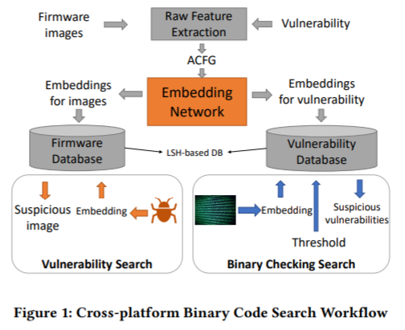
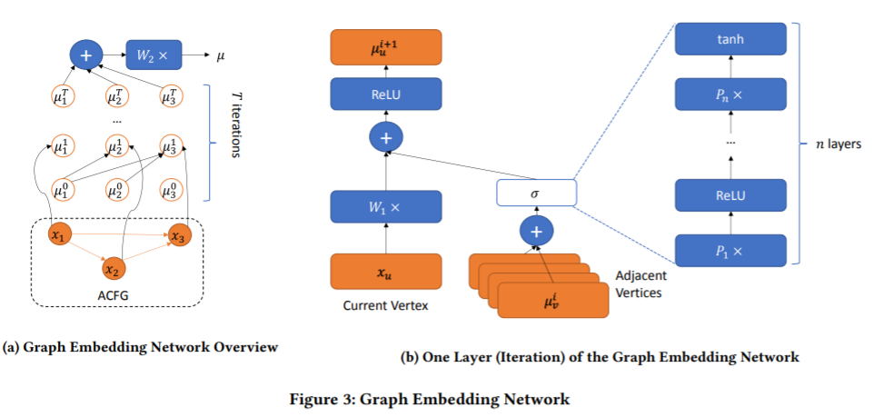
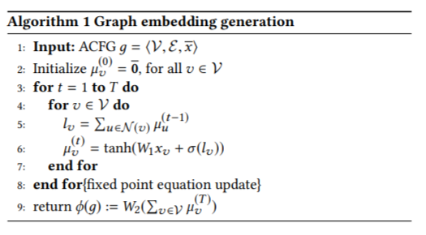

## Neural Network-based Graph Embedding for Cross-Platform Binary Code Similarity Detection (Gemini)

### Model
ACFG (attributed control flow graph)：首先,对混淆后的二进制进行逆向,将函数转换为能描述其功能特征和混淆特征的数字向量,包括控制流程图特征、描述流程图基本块的操作码特征和常量特征,即将控制流程图(Control Flow Graph)转换为属性特征控制流程图

Structure2vec：迭代地计算vertex embedding，相加得到graph embedding

Siamese Artitecture：余弦相似度，损失函数并没有用Contrastive loss？

### Evaluation

Bipartite Graph Matching (BGM)
Codebook-based Graph Embedding (Genius)

ROC curve

## VulSeeker: A Semantic Learning Based Vulnerability Seeker for Cross-Platform Binary

### keypoints
Cross-Platform

### method
- LSFG construction
- block feature extraction
- function semantics generation
- similarity calculation

异构图embedding？ 每种节点一个embedding

为什么用structure2vec？

加大数据量，不同函数组成对

## VulSeeker-Pro

## PDiff: Semantic-based Patch Presence Testing for Downstream Kernels

patch 补丁 vendor 设备厂商
these vendors often omit or delay the adoption of patches released in the mainstream version.

semantic summaries related to a target patch

compare target kernels which are before and after the adoption of the patch

### 传统方法
#### POC (Proof of Concept)
概念测试
A POC (proof of concept) is an advanced demo project that reflects a real-world scenario.
#### signature
FIBER

### Method
measure the distance 

#### Anchor Block Selection
locate patch-related functions
- Versions 
- Identify Patch-related:
    - parse the source code while determining the functions.
    - deleted code and added code
- Select Anchor Block
    为什么要选择Anchor Block???函数的一个片段吗
    3个属性

#### Patch Summary Generation
- Extract Path Digests
- Representation of Path Digests
    - Path constraints
    - Memory status: 
    - Function call list: name no arguments

#### Summary-based Patch Presence Testing
Patch digest => Patch summary
sim(target,pre) sim(target,post)
target kernel 与 post kernel有什么区别？

### Evaluation
FIBER & PDiff
- Effectiveness
- tolerate code customization
- tolerate diversities in building configurations

## Finding Bugs Using Your Own Code: Detecting Functionally-similar yet Inconsistent Code (2020)
### Method
not "learn-from-bugs": need data; limited types
data source: codebase
data: **inconsistent implementation**?

## 综述阅读

IoT设备的特点
- 厂商投入不足
- 依赖开源
- 异构性高，自动化漏洞检测难
- 补丁更新难

基础工具：

模拟器+设备
Avatar, firmadyne

网络扫描：

### 代码相似性检测：

BinDiff BinSlyzer CFG同构性的相似性度量

Blanket Execution 静态分析建立二进制文件语义相似性，不好！ 动态运行时的特征

BinHunt iBinHunt 符号执行 定理证明技术

#### 解决异构性
Multi-MH 跨CPU架构，转二进制为中间码
DiscovRE 使用图匹配算法来检查一组函数对的控制流图表达是否相似，并利用预过滤阶段来加速控制流图匹配的过程
BinGo 引进选择性内联相关库函数和用户自定义函数来捕获完整的函数语义
Genius Graph embedding
Gemini 效率 准确率 提升
VulSeeker

### 漏洞修复
漏洞二进制集 修复二进制集

这怎么训练得到漏洞特征啊

## A Survey of Binary Code Similarity

### Comparison type

- Syntactic similarity
- Structual similarity: Graph representation
- Semantic similarity

problems: inline

### Comparison granularity (粒度)

- instructions
- basic blocks
- functions
- program

### Number of inputs

- One to One
- One to Many
- One to Many

## Application

- Bug search
- Malware detection
- Malware clustering
- Malware lineage
- Patch generation and analysis
- Porting information (移植)
- Software theft detection (软件偷窃)
